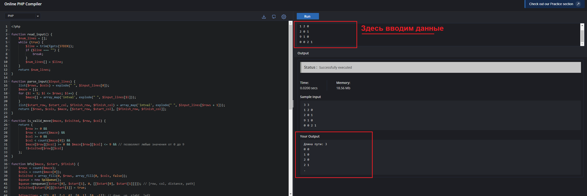

### Инструкция запуска

1. Переходим на сайт 
    
    `https://www.codechef.com/php-online-compiler`
    
2. Вставляем в редактор кода скрипт из файла main.php
3. В окне ввода параметров вводим данные лабиринта

Закономерный результат с данными из ТехноТест: 

